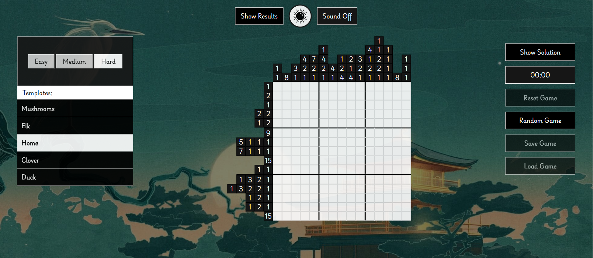
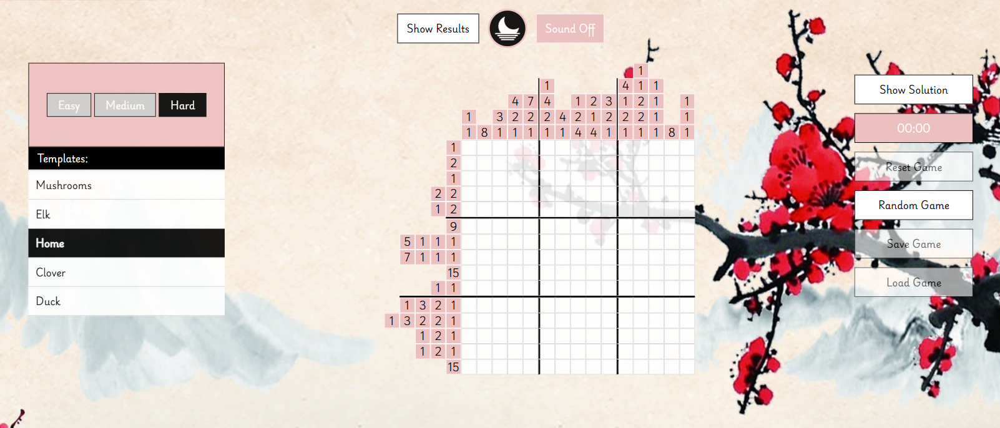

# Nonograms 

**Nonograms** — A classic Japanese puzzle game (picross, griddlers). A web-based logic game built with JavaScript and modular architecture.
Players solve puzzles by filling cells based on numerical clues to reveal hidden pictures.

## 🌐 Live Demo
* [Netlify](https://q-nonograms.netlify.app/)

## 🖥️ Screenshot

## Features

1. Three difficulty levels:
   - Easy: 5×5 grid 
   - Medium: 10×10 grid 
   - Hard: 15×15 grid
2. Left/right click controls for filling and marking cells 
3. Timer and best results tracking (top 5)  
4. Save/load game progress via localStorage  
5. "Show Solution", "Reset", and "Random Game" buttons
6. Theme toggle (light/dark) and sound settings
7. Responsive design with burger menu for mobile 
8. Audio feedback for clicks and victory  
9. Automatic solution validation

## Tech Stack

* **JavaScript**
* **CSS**

## Run Locally
1. Clone the repo: git clone https://github.com/SquallerQ/nonograms
2. Open index.html in your browser